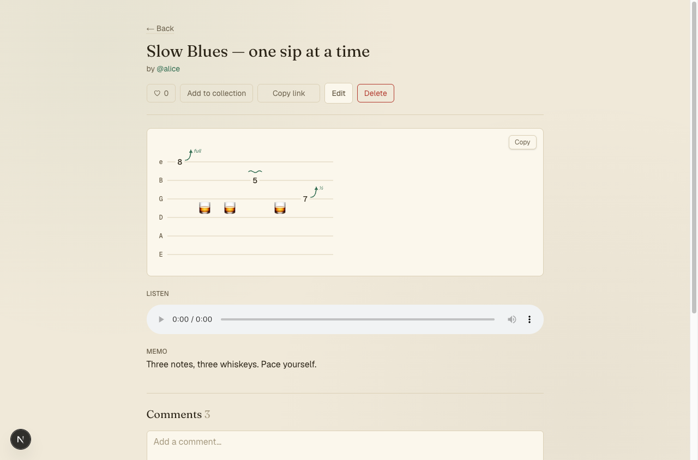
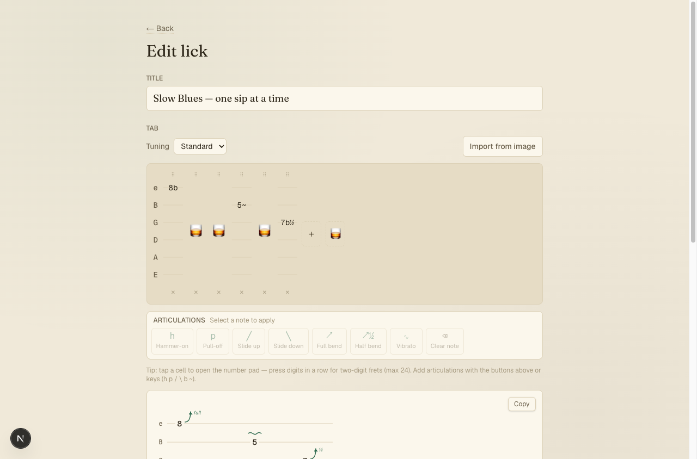
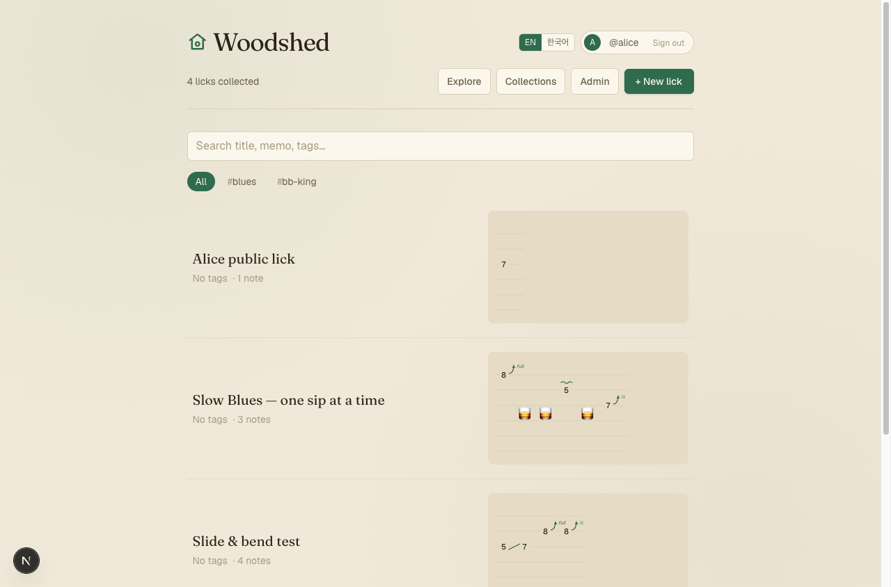
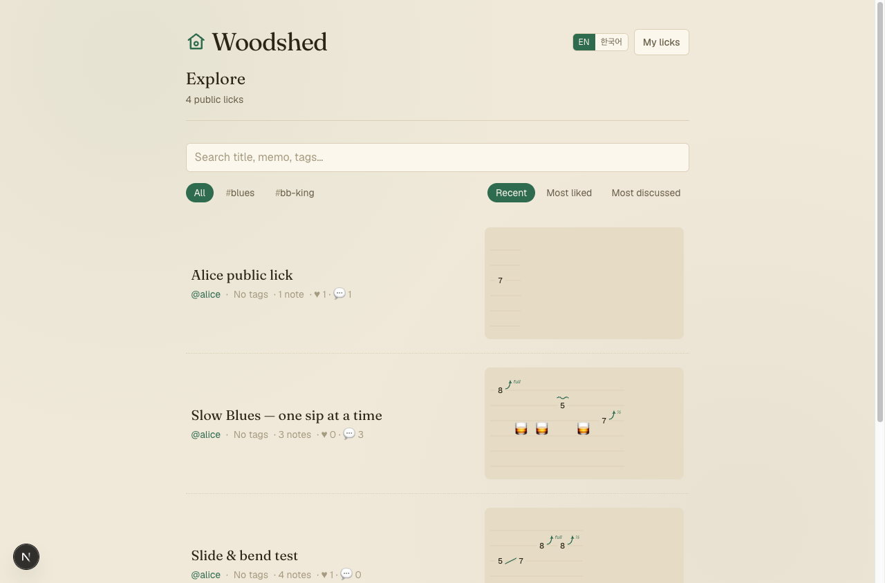
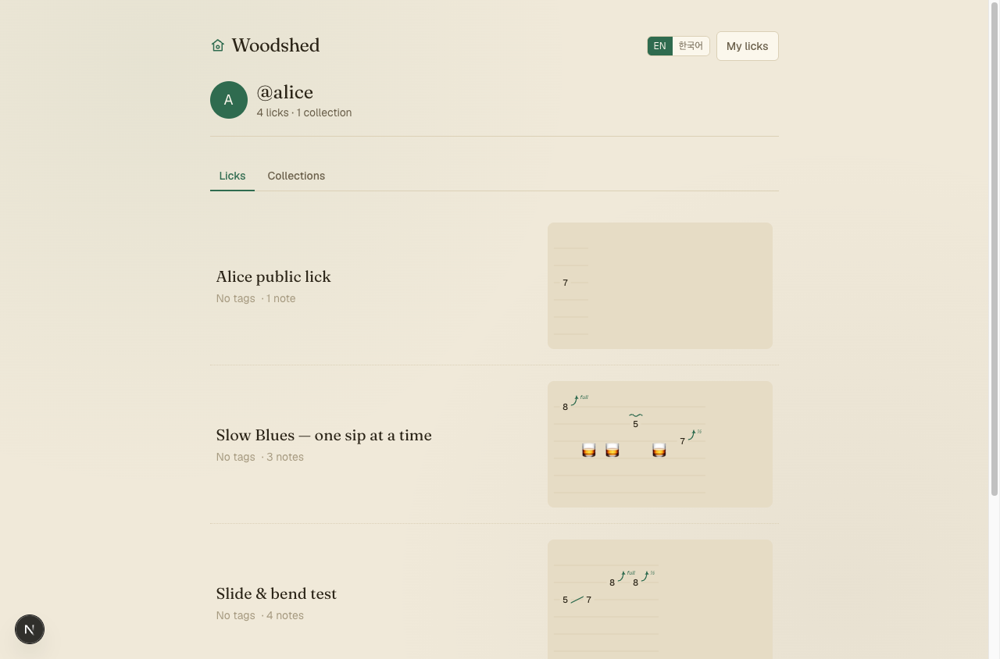
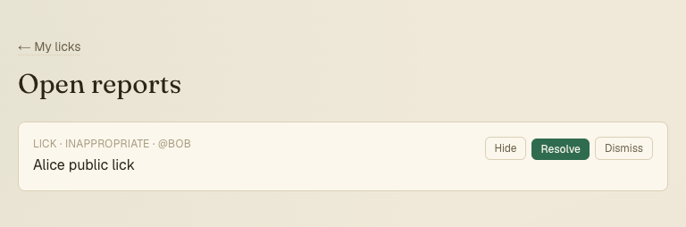

# ♪ Woodshed

A community where guitarists write down **licks** (short phrases), store them as TAB, and share, discover, and discuss them.

> *Woodshed* (verb): to practice intensively, on your own. This is a place to woodshed your licks.

## Features

- **Graphic TAB editor** — click frets on a 6‑string grid; articulations (hammer‑on/pull‑off, slides, full/half bends, vibrato) rendered as a real sheet‑music staff. Live ASCII preview + copy. Works on mobile via the native numeric keypad.
- **Accounts** — Google OAuth, unique handles, public profiles at `/u/[handle]`.
- **Ownership & visibility** — every lick is private, unlisted (link‑only), or public; only the owner can edit.
- **Discovery** — public `Explore` feed with keyword/tag search and sorting (recent · most liked · most discussed).
- **Social** — likes, comments, and collections (playlists).
- **Trust & safety** — reporting, an admin moderation queue (hide/resolve/dismiss), comment rate limiting.
- **Localized** — English and Korean (cookie‑based, default English).

## Screenshots

| | |
| :---: | :---: |
|  |  |
| **Lick page** — sheet‑music staff, audio, memo & comments | **Graphic TAB editor** — fret grid, articulations, live staff preview |
|  |  |
| **Your licks** — personal library with search & tag filters | **Explore** — public feed, sort by recent · most liked · most discussed |
|  |  |
| **Public profile** — licks & collections at `/u/[handle]` | **Moderation queue** — hide · resolve · dismiss reports |

## Tech stack

- Next.js (App Router) + React + TypeScript
- Auth.js (next‑auth v5) with the Drizzle adapter, JWT sessions
- Drizzle ORM + libSQL (Turso in production, a local SQLite file in dev)
- Tailwind CSS v4, Vitest

## Local development

1. Configure env:
   ```bash
   cp .env.example .env
   ```
   - Set `AUTH_SECRET` (`npx auth secret` or `openssl rand -base64 33`).
   - Without OAuth credentials, keep `AUTH_DEV_LOGIN=1` to use the dev‑only mock login.
   - To exercise real Google sign‑in, fill `AUTH_GOOGLE_ID` / `AUTH_GOOGLE_SECRET` and set `AUTH_DEV_LOGIN=0`.
2. Install and migrate:
   ```bash
   npm install
   npm run db:migrate
   ```
3. Run:
   ```bash
   npm run dev    # http://localhost:3000
   ```

Admin access is granted to emails listed in `AUTH_ADMIN_EMAILS`, or by setting `user.role = 'admin'` in the database.

## Testing

```bash
npm test      # unit tests (repositories, TAB serialization, editor ops)
npm run lint
npm run build
```

## Deployment

Vercel + Turso. See [`DEPLOY.md`](./DEPLOY.md) for the full runbook (database, env vars, Google OAuth redirect URIs).

## Project layout

```
src/
  app/          # routes (home, explore, profile, collections, admin, lick pages, login, onboarding)
  components/   # TAB editor/staff, cards, header, social controls, ui primitives
  lib/
    db/         # Drizzle schema + repositories (licks, social, moderation)
    auth/       # Auth.js config (edge-safe + node), current-user helpers
    i18n/       # dictionaries (en/ko) + provider
    tab/        # TAB types, editor operations, ASCII serialization
```
